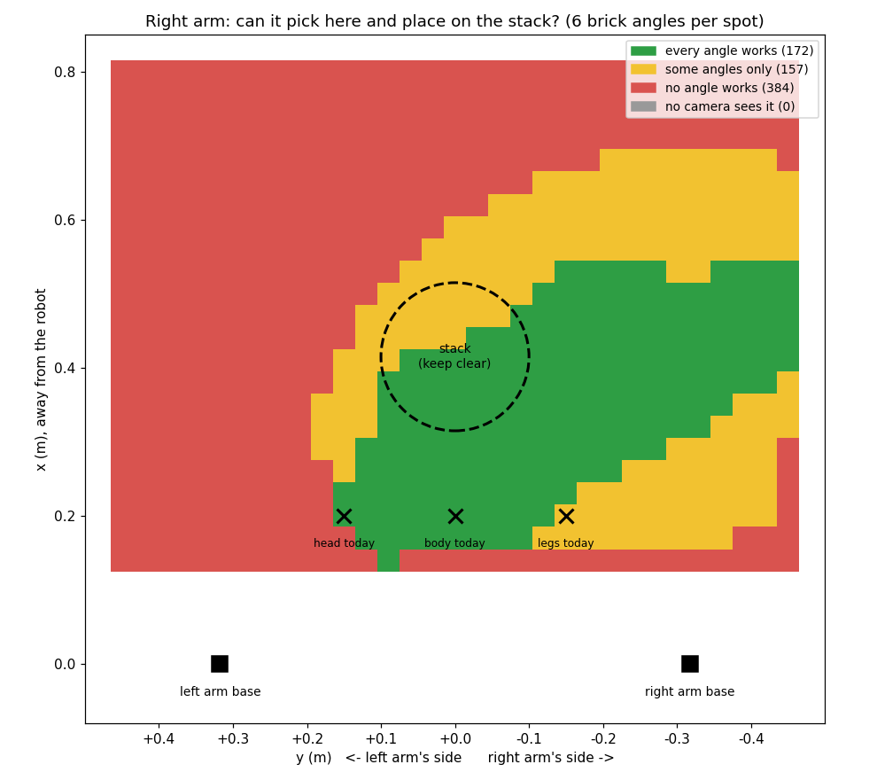
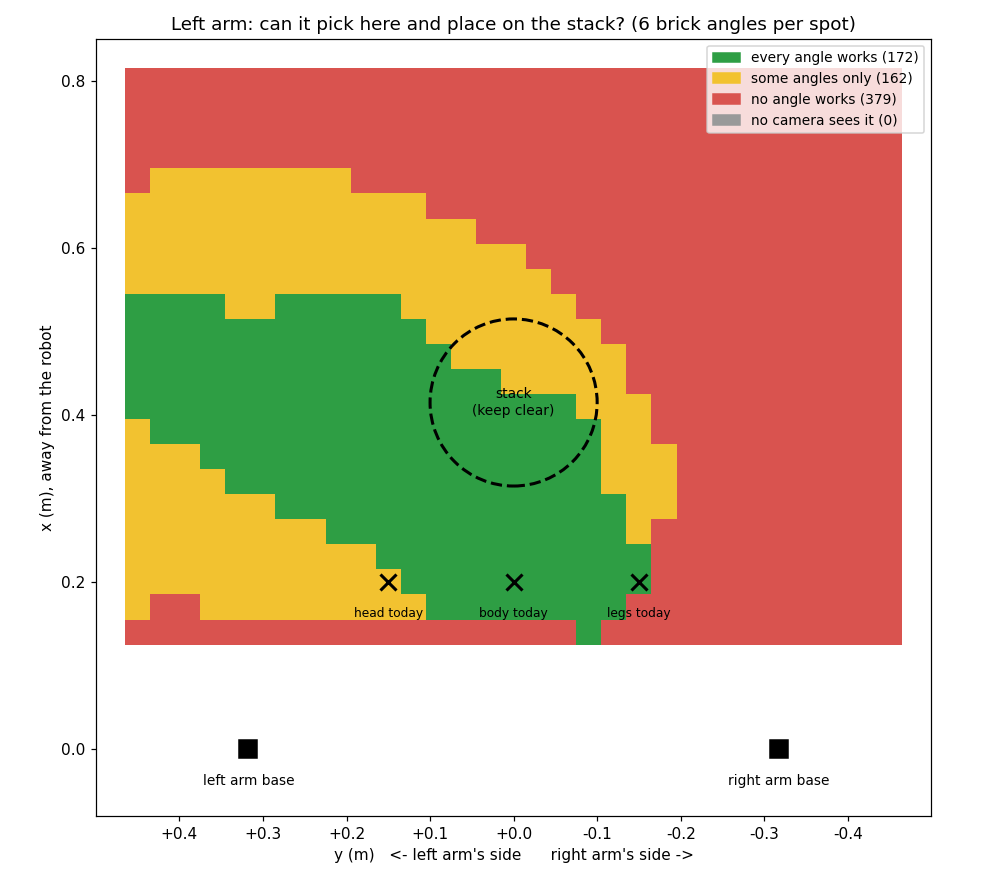
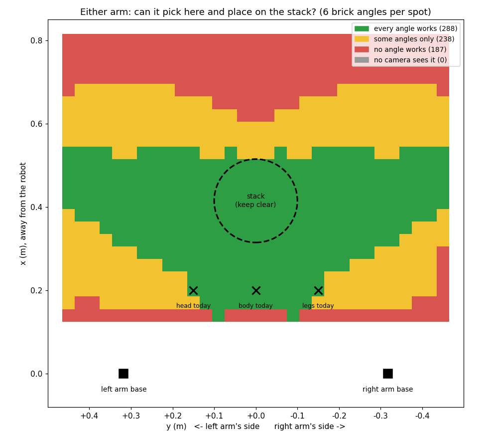

# mujoco-robot

Reusable scaffolding for loading and viewing robot models from
[mujoco_menagerie](https://github.com/google-deepmind/mujoco_menagerie),
with automatic rendering-backend fallback for WSL2 — plus the stationlite
dual-arm robot and the zebra DUPLO pick/place that talks to Victor's
`zebra_bt` behavior tree over ROS2.

Lives on Windows at `C:\intern\mujoco-robot`, which is `/mnt/c/intern/mujoco-robot`
from inside WSL2 — run everything from your Ubuntu terminal where `mujoco` is pip-installed.

## Setup (in WSL2 Ubuntu)

```bash
$ cd /mnt/c/intern/mujoco-robot
$ pip install -r requirements.txt
```

The zebra commands also need ROS2 Humble and Victor's `build_a_zebra`
package built in `~/ros2_ws` (from the `Victor` branch):

```bash
$ cd ~/ros2_ws && source /opt/ros/humble/setup.bash
$ colcon build --packages-select build_a_zebra
```

## How to run

All commands are run from `/mnt/c/intern/mujoco-robot` in WSL.

### Zebra pick/place with Victor's behavior tree (the main one)

Starts Victor's `zebra_bt` tree and our skill bridge together in one
terminal. The MuJoCo window opens and the arms stack legs -> body -> head
on the green circle, finishing with `3 placed, 0 escalated` (~55-90s). Each
brick is picked by the arm nearest to it (below).
Victor's tree picks every target: picks where perception last saw the brick,
places at his stack positions. All positions, perception included, are the
brick's origin in the MuJoCo world frame (his `INTERFACE.md`, section 2b).
Output lines are labelled `[tree]` / `[bridge]`; close the MuJoCo window or
press Ctrl+C to stop both.

```bash
$ bash scripts/run_zebra.sh
```

The bricks start **scattered**: each at a random spot and angle (upright),
only where an arm can pick it up and place it on the stack at every angle -
the green area of the arms' reach maps (see Notes below; `src/mjrobots/scatter.py`,
at least 10 cm apart and 10 cm clear of the stack). Every run is a new
random scatter, and the first bridge line says which, e.g.
`scatter seed 7: legs (0.51, -0.38) 41 deg, body (0.48, -0.17) 84 deg, ...`.
Replay a scatter by its seed, or start from the old fixed square spots:

```bash
$ bash scripts/run_zebra.sh --scatter 7
$ bash scripts/run_zebra.sh --fixed-start
```

**Nearest arm per brick.** A brick in only one arm's green area is picked
by that arm; in both (the middle) or neither, by the arm whose base is closer
(`scatter.choose_arm`). The place always goes to the arm holding the brick.
Before an arm moves, the other arm is parked at its home joint angles
(`go_home`) - otherwise it's still hovering over the stack from its last
place, right where this arm is going (measured without parking: the arms'
planned paths overlapped by 7.7 cm). If a command names an arm
(`"arm": "left"`), that arm does it - Victor's tree doesn't send one yet, so
it can take the choice over later without changes here. One arm for
everything, scattered in that arm's own area only:

```bash
$ bash scripts/run_zebra.sh --arm left
```

Checked headless (ideal perception, real physics): 50 seeds, 150/150
bricks placed, 80 by the right arm and 70 by the left; 44 seeds used both
arms. Place error 0.8 cm average (max 1.8 cm); the arms never came closer
than 8.1 cm (median closest 19.5 cm). Right arm alone, in its own area: also
150/150, max 1.6 cm. About half the bricks (72 of 150) were set down turned
180 deg (same footprint, printed face reversed): from most angles the square
grip isn't reachable at the stack - it never happened from the fixed square
spots.

Confirm before moving (for the first real-robot runs): each arm move prints
every joint's current angle, target, and change (flagging changes over
0.5 rad), then waits - ENTER moves, `q` + ENTER refuses the move (the arm
stays put and the skill reports FAILED). `first` asks only before the first
move; `all` asks before every move. Answer within zebra_bt's 30 s skill
timeout.

```bash
$ bash scripts/run_zebra.sh --confirm-moves first
```

Every arm move - parking included - is also checked against the other arm
before it runs (the sim itself lets the arms pass through each other): a
move that would bring the arms - or a held brick - within 2 cm is refused
and the skill reports `FAILED` (`src/mjrobots/arm_clearance.py`).

### Fail tests (Victor's retry / escalate behaviour)

The results below were measured from the old fixed brick spots with the
right arm doing everything, so add `--fixed-start --arm right` to see the
same thing (from a scatter, which camera sees a brick - and so how a missed
pick is noticed - depends on where it lies and which arm is over it).

`--fail-part` sends every pick of that part 8 cm to the side of the real
brick, and the pick is reported `FAILED` one of two ways. Legs and head:
the arm looks again from above the (wrong) spot, sees the brick 8 cm away,
and gives up before descending ("brick is 7.9 cm from where the pick was
aimed"). Body: the arm hides it from the head camera at that point, so the
arm descends and the gripper closes on nothing (the fingers close to ~0 cm
instead of stopping at the brick's 3.2 cm). Either way the tree retries it. After the 4th failed pick the tree
gives up on that part ("retries exhausted, escalating to human"), and
anything stacked on top of it is skipped.

Body fails: legs placed, body escalated after 4 attempts, head skipped:

```bash
$ bash scripts/run_zebra.sh --fail-part body
```
→ `1 placed, 2 escalated`

Legs fail: nothing can be stacked, so all three escalate:

```bash
$ bash scripts/run_zebra.sh --fail-part legs
```
→ `0 placed, 3 escalated`

Head fails: legs and body placed, head escalated:

```bash
$ bash scripts/run_zebra.sh --fail-part head
```
→ `2 placed, 1 escalated`

Change how far off the pick goes (metres, default `0.08`). Small offsets
don't miss: up to 4 cm the look again from above corrects the aim (legs,
head), and the closing fingers push the brick into the middle of the jaws
anyway (measured on the body: 3 cm off still grasps, 5 cm misses), as a
real gripper would:

```bash
$ bash scripts/run_zebra.sh --fail-part body --fail-offset 0.05
```

Only fail the first N picks with `--fail-times N`. Here the body's first pick
misses, and the retry picks it normally:

```bash
$ bash scripts/run_zebra.sh --fail-part body --fail-times 1
```
→ `3 placed, 0 escalated`, body `attempt 2`

Relocate instead of retry: add `--fail-bump`. The missed pick also knocks the
brick 5 cm towards the stack, and perception reports it `LOST` for 2s. The
tree logs `will re-locate and retry`, waits for perception to find the brick
again, and picks it at its **new** position:

```bash
$ bash scripts/run_zebra.sh --fail-part body --fail-times 1 --fail-bump
```
→ `3 placed, 0 escalated` (~62s)

Knock a placed brick off the stack: `--knock-placed PART` knocks that part
8 cm sideways right after its first place. The bridge looks at every brick
it places before reporting success, so this place is reported `FAILED`
("placed brick didn't stay put: it's 8.2 cm to the side, -3.9 cm below the
target"), the tree re-locates it, and it is re-picked from where it fell and
placed again:

```bash
$ bash scripts/run_zebra.sh --knock-placed body
```
→ `3 placed, 0 escalated`, body picked and placed twice

Knock a brick off later: `--knock-later PART` knocks it off the stack after
its own landing check passed. Before every place the bridge looks at the
bricks already stacked, so the next part isn't stacked onto nothing: it's
put back where it was picked and the place fails ("won't place body: the
stack below it is broken (legs: 8.3 cm to the side)"). The second time, the
part is escalated to a human (the tree can't redo a part it already counts
as placed). Once every part is placed, the bridge also checks the whole
zebra ("zebra check: all 3 bricks in place"):

```bash
$ bash scripts/run_zebra.sh --knock-later legs
```
→ `1 placed, 2 escalated` (body refused twice and escalated, head skipped)

No perception at all: run only the tree, without the bridge. The legs are
never found; after 3 searches of 10s each they escalate, and body and head
are skipped:

```bash
$ source /opt/ros/humble/setup.bash && source ~/ros2_ws/install/setup.bash
$ export ROS_DOMAIN_ID=42 RMW_IMPLEMENTATION=rmw_cyclonedds_cpp
$ ros2 run build_a_zebra zebra_bt_node
```
→ `0 placed, 3 escalated` (~34s)

If the MuJoCo window doesn't appear, restart WSL from Windows PowerShell
(`wsl --shutdown`), then open WSL and run again.

If a run finishes with `3 placed` after ~1s without the arm moving, a bridge
from an earlier run is still open and reporting every part as `PLACED`. Close
its MuJoCo window, or stop everything:

```bash
$ pkill -9 -f zebra_skill_bridge.py; pkill -f zebra_bt_node
```

<details>
<summary>Running the two parts in separate terminals instead</summary>

Each terminal first needs:

```bash
$ source /opt/ros/humble/setup.bash
$ export ROS_DOMAIN_ID=42
$ export RMW_IMPLEMENTATION=rmw_cyclonedds_cpp
```

Terminal 1 — Victor's tree:

```bash
$ source ~/ros2_ws/install/setup.bash
$ ros2 run build_a_zebra zebra_bt_node
```

Terminal 2 — our bridge (MuJoCo viewer + IK + perception):

```bash
$ python3 scripts/zebra_skill_bridge.py
```

Do **not** also run `zebra_publisher.py`: the bridge already publishes
perception from the simulation the arm moves in (the publisher refuses to
start if it sees the bridge running).
</details>

### Zebra pick/place on its own (no ROS2)

Moves `zebra_legs` from its spawn spot to the green circle, without Victor's tree:

```bash
$ python3 scripts/zebra_pick_place.py
$ python3 scripts/zebra_pick_place.py --arm left
```

### Perception publisher on its own

Publishes the calibrated `zebra_legs` position on `/zebra/perception_updates`
(needs the ROS2 setup lines above). It simulates its own static copy of the
scene, so it only ever reports the spawn position — for testing perception,
not for a full run:

```bash
$ python3 scripts/zebra_publisher.py
```

Watch what's being published, in another terminal:

```bash
$ ros2 topic echo /zebra/perception_updates
```

### Camera calibration

Aligns the 4 stationlite cameras into one shared frame (headcam) and prints
how accurately each one locates the block:

```bash
$ python3 scripts/camera_calibration.py
$ python3 scripts/camera_calibration.py --loop      # keep reporting until Ctrl+C
$ python3 scripts/camera_calibration.py --view      # also open the MuJoCo viewer
```

The hand cameras ride on the arms, so their readings are first corrected for
the arm's current pose (forward kinematics), then converted into the headcam
frame.

**Checking the cameras.** A headless check (no ROS, no display, ~5 s): it
calibrates the cameras the same way zebra_publisher does, then tests every
camera against the brick's true position with the arms at home, hovering over
the stack, hovering over each brick, and in random arm poses, with the bricks
both spread out and stacked. It prints a summary per camera and ends with
`PASS` (every camera within 1 cm) or `FAIL` (exits non-zero). Run it after
changing the cameras, the scene XML, or the calibration:

```bash
$ python3 scripts/check_camera_agreement.py
$ python3 scripts/check_camera_agreement.py --tol 0.005                       # allowed error in metres (default 0.01)
$ python3 scripts/check_camera_agreement.py --pixel-noise 0 --depth-noise 0   # noise-free: should show 0.00 cm
$ python3 scripts/check_camera_agreement.py --seed 1                          # different random poses and noise
```

### Move an arm to a point (Cartesian control)

Runtime IK: drives one stationlite arm's fingertips to any XYZ point (a red
sphere marks the target; prints the final error):

```bash
$ python3 scripts/cartesian_control.py --target 0.45 0.1 -0.05
$ python3 scripts/cartesian_control.py --arm right --target 0.4 -0.2 -0.1
```

### Stationlite two-arm block stacking

Right arm places its block in the middle, left arm stacks its own on top:

```bash
$ python3 scripts/stationlite_pick_place.py
```

> **Currently broken:** the scene's `block_right` / `block_left` cubes were
> replaced by the three zebra bricks, and this demo still looks them up by name.

### Panda pick-and-place

Menagerie's Panda picks up a cube and sets it on a table:

```bash
$ python3 scripts/pick_place.py
```

### Just look at a model

Any `.xml` / `.urdf` by path (Tab for the side panel, `[` / `]` to cycle
cameras: free cam, headcam, refcam, left_handcam, right_handcam):

```bash
$ python3 scripts/view_file.py stationlite/urdf/stationlite_pick_place.xml
```

A menagerie robot by name:

```bash
$ python3 scripts/view.py franka_emika_panda
$ python3 scripts/view.py --list
```

Every Python script also takes `--gl osmesa` to try a different rendering
backend if the default (`egl`) doesn't work.

## Layout

```
mujoco-robot/
├── src/mjrobots/
│   ├── gl.py                      # MUJOCO_GL backend selection + software-render fallback
│   ├── models.py                  # finds mujoco_menagerie, resolves model name -> scene.xml
│   ├── viewer.py                  # load()/view() helpers
│   ├── pick_place.py              # damped-least-squares IK + scripted pick-and-place motion
│   ├── stationlite_pick_place.py  # two-arm block-stacking demo (stationlite robot)
│   ├── cartesian_control.py       # runtime IK to an arbitrary XYZ point
│   ├── camera_calibration.py      # aligns the 4 stationlite cameras into one shared frame
│   ├── zebra_pick_place.py        # grasp/place one zebra brick via runtime IK
│   ├── zebra_publisher.py         # perception: calibrated brick position -> ROS2
│   ├── scatter.py                 # random brick start spots, inside the arm's reach zone
│   └── zebra_skill_bridge.py      # executes zebra_bt pick/place commands + publishes perception
├── scripts/                       # CLI entry points for each module above, plus:
│   ├── check_camera_agreement.py  # headless check: every camera agrees with ground truth
│   ├── reach_map.py               # where each arm can pick+place; writes the scatter zones
│   └── run_zebra.sh               # one-command launcher: zebra_bt + skill bridge
├── stationlite/                   # stationlite URDF, meshes, and the MuJoCo scene XML
└── requirements.txt
```

## How the pieces work

**Pick-and-place (Panda).** The scene (`src/mjrobots/assets/pick_and_place_scene.xml`)
adds a table, a cube, and a target marker next to the Panda arm;
`src/mjrobots/pick_place.py` drives the arm with Jacobian inverse kinematics
(`_solve_ik`) to reach a sequence of Cartesian waypoints (approach, descend,
grasp, lift, transport, place, retreat), ramping the joint-position actuators
(`data.ctrl`) toward each solved pose so MuJoCo's own physics — not a
scripted teleport — carries the cube.

**Stationlite stacking.** The stationlite robot's files live in `stationlite/`
(URDF + meshes, tracked in this repo). `stationlite/urdf/stationlite_pick_place.xml`
wraps the URDF with actuators, a table, the zebra bricks, and camera
viewpoints. Stacking waypoints are joint angles found by an offline
forward-kinematics search. Grasping is a kinematic "carry" rather than pure
friction: once a gripper closes on its block, the block's position is
snapped to the fingertip midpoint each step until release — the mesh-only
finger geometry isn't reliable enough to hold an object through arm motion
on its own (confirmed experimentally).

**Cartesian control.** Interpolates a straight line of Cartesian waypoints
from the hand's current position to the target and re-solves damped-least-squares
IK at each one (warm-started from the arm's current pose), then ramps
`data.ctrl` through each solution while stepping physics — so the hand's
path stays close to a straight line, not just the joints'.

## Notes

### Arm reach maps (2026-09-29)

Where on the table can each arm pick a brick up and put it on the stack?
Measured before scattering the bricks randomly, so random spots are only
drawn from where the pick can actually work.



How it was measured: the legs brick was put on a 3 cm grid over the table
(x 0.14–0.80, y ±0.45; 713 spots) at 6 angles each (every 30°; a brick looks
the same turned 180°). At each one, the bridge's real pick and place moves
were planned with the same IK, joint-jump and arm-clearance checks
(`grasp_part`, then `place_part` at stack levels 0 and 2), and the arm was
jumped to the end of each planned move instead of simulating it (planning is
where every refusal happens, so this is fast and gives the same yes/no). The
other arm stayed at home. Cameras were asked whether any of them sees a brick
there, with the arms at home.

What the right arm's map shows:

- **Green (172 spots): every angle works.** Roughly x 0.16–0.53 on the right
  arm's own side, narrowing towards the middle. Nothing works past y ≈ +0.15
  (the left arm's side).
- **Too close to the robot** (x < 0.15) fails: the joints would jump more
  than 0.2 rad between steps.
- **Far away** (x > 0.55) works at some angles only (yellow), then none: the
  grip orientation can't be reached there.
- **Today's legs spot (0.2, −0.15) sits on the edge:** a brick turned 30°
  there can be picked but not placed (IK can't reach the stack in the grip
  that fits it). It works today only because the bricks start square.
- **Every spot is seen by a camera** (headcam and refcam), so perception
  can find a brick anywhere on the table.

The left arm is almost an exact mirror image (also 172 green spots). Even
the edge case mirrors: at today's head spot (0.2, +0.15) the left arm can't
place a brick turned 150°.



**Either arm** (a spot and angle counts if at least one arm can do it) -
what using the nearest arm per brick would cover: **288 green spots, up from
172 with one arm (+67%)**. The two arms' green areas overlap in the middle
(71 spots either arm can do at every angle), which is where the choice of
arm is free.



## Menagerie location

`models.py` looks for your existing `mujoco_menagerie` clone at (in order):

1. `$MENAGERIE_ROOT` if set
2. `/mnt/c/Users/pokem/mujoco_test/mujoco_menagerie` (WSL2 view of your existing Windows clone)
3. `C:\Users\pokem\mujoco_test\mujoco_menagerie` (native Windows view)
4. `~/mujoco_test/mujoco_menagerie` (native WSL clone, if any)

It isn't copied into this project (it's ~2.4GB) — set `MENAGERIE_ROOT` to
point elsewhere if you move or re-clone it.
